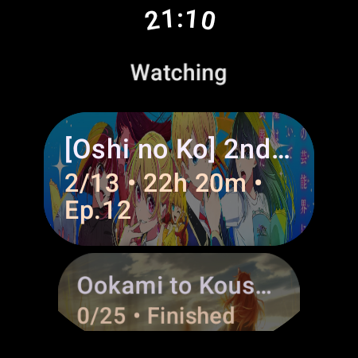
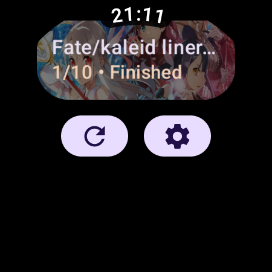
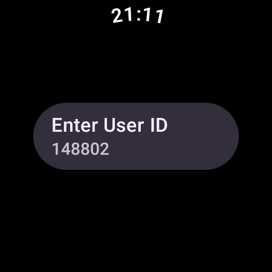
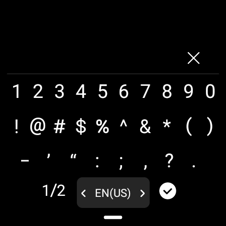

# Anime Schedule Watcher

## Table of Contents

1. [Overview](#overview)
2. [Features](#features)
3. [Installation](#installation)
4. [Usage](#usage)
5. [Screenshots](#screenshots)
6. [Technologies Used](#technologies-used)
7. [Contributing](#contributing)
8. [License](#license)
9. [Contact](#contact)

---

## Overview

**Anime Schedule Watcher** is an Android Wear app that helps you keep track of your currently watching anime. The app fetches data from [AniList's](https://anilist.co/) GraphQL API, showing the progress of episodes and upcoming air times.

## Features

- Fetches anime schedule data from AniList using GraphQL.
- Displays your current watchlist with progress and upcoming episodes.
- Settings page to configure preferences like User ID.
- Support for Android Wear OS.

## Installation

### Prerequisites

Before you begin, ensure you have met the following requirements:

- Android Studio installed on your development machine.
- A valid [AniList API](https://anilist.co/graphiql) access.
- Wear OS device or emulator.

### Important Note:

This app is **not available on the Play Store**, so you won't be able to directly install the APK on your watch unless you have **Developer Mode enabled** or use a tool like `adb`. Please ensure your Wear OS device is configured for sideloading if you want to install this app.

### Steps

1. **Clone the repository:**

    ```bash
    git clone https://github.com/seyone22/anime-schedule-watcher.git
    cd anime-schedule-watcher
    ```

2. **Open the project in Android Studio:**

   - Open `Android Studio`, then select `Open an existing Android Studio project` and navigate to the cloned directory.

3. **Build the project:**

   - In Android Studio, click the `Build` option and then select `Rebuild Project`.

4. **Run the project:**

   - Connect your Wear OS device or emulator, then click the `Run` button to install and launch the app on your device.

5. **Set your AniList User ID:**

   - Open the app on your Wear OS device, go to Settings, and input your AniList User ID to begin fetching your currently watching anime.

## Usage

Once the app is installed:

- **View your schedule:** The main screen will display a list of anime you are currently watching, with progress and episode details.
- **Modify settings:** You can input or change your AniList User ID in the settings screen.

## Screenshots

Here are some screenshots of the app in action:


*Main screen displaying current anime list*


*Detailed view of an anime entry with progress and episode details*


*Settings screen to enter AniList User ID*


*Refreshing the anime list*

## Technologies Used

- **Kotlin** - Main programming language for Android development.
- **Compose for Wear OS** - For building the user interface with Jetpack Compose.
- **Retrofit & OkHttp** - For making network requests to the AniList GraphQL API.
- **Kotlinx Serialization** - To parse the GraphQL responses.
- **Wearable API** - To communicate with Wear OS features.
- **Android DataStore** - To store user preferences locally.

## Contributing

If you'd like to contribute to this project, follow these steps:

1. Fork the repository.
2. Create a new feature branch (`git checkout -b feature/YourFeature`).
3. Make your changes and commit them (`git commit -m 'Add YourFeature'`).
4. Push to the branch (`git push origin feature/YourFeature`).
5. Open a pull request and provide a detailed description of your changes.

We welcome feature requests and contributions from the community! Please ensure that your code follows the repository's coding standards.

## License

This project is licensed under the MIT License - see the [LICENSE](LICENSE) file for details.

## Contact

- **Project Maintainer:** [Seyone G](mailto:s.g.seyone@live.com)
- **GitHub:** [seyone22](https://github.com/seyone22)

If you have any questions, feature requests, or suggestions, feel free to reach out via email or open an issue in the repository.
